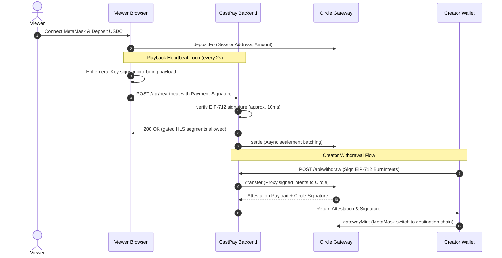

# CastPay: Continuous Streaming Monetization Infrastructure

CastPay is a production-grade, non-custodial pay-per-second and pay-per-minute settlement sidecar for live video and Video on Demand (VOD). It allows content creators to monetize live streams and VOD catalogs directly on the **Arc Testnet** using **Circle Gateway** pre-authorized USDC batching.

---

## 1. How Viewers Join & Watch

Viewers connect their web3 wallet, fund a local session gateway balance, and pay continuously for media content with zero MetaMask popups during active streaming.

### Step 1: Wallet Connection
* Navigate to the CastPay portal and click **Launch App**.
* Choose **Viewer Portal**.
* Connect your MetaMask wallet. The portal will prompt you to switch to the **Arc Testnet**. If the network is not in your wallet, MetaMask will automatically add it with your custom Canteen RPC.

### Step 2: Fund the Gateway Wallet
* Ephemeral Session Keys are generated locally in the browser to sign high-frequency micro-billing heartbeats automatically.
* Viewers must fund this session's gateway balance:
  1. Click **Deposit**.
  2. Input the amount of USDC you wish to allocate (e.g. `2.00` USDC).
  3. Approve the transaction via MetaMask (triggers ERC-20 approval and `depositFor` on the Circle Gateway contract).

### Step 3: Stream Content
Depending on the stream type registered by the creator, the viewer portal dynamically mounts the appropriate player/simulator:

#### A. Owncast Live Streams (Pay-Per-Second)
* Click **Pay & Watch**.
* An initial heartbeat payment handshake is signed by your session key and verified by the backend.
* The gated HLS proxy mounts the live video stream.
* A payment heartbeat is automatically submitted every 2 seconds (`0.0002` USDC base + 1.5% platform fee = `0.000203` USDC).
* A floating particle system displays micro-transactions ascending in real-time.

#### B. Jellyfin VOD Simulator (Pay-Per-Minute)
* switch to the **Jellyfin Simulator** tab.
* Click **Play** to start watching VOD content (submits a simulated `PlaybackStart` webhook to the backend sidecar).
* Click **Simulate 1 Min Watch** to fast-forward time (submits `PlaybackProgress` webhook, settling the pro-rated per-minute billing fee on-chain).
* Click **Stop** to end playback (settles the final pro-rated billing amount down to the exact second).

#### C. PeerTube VOD Simulator (Flat Tip)
* Switch to the **PeerTube Simulator** tab.
* Click **Simulate Tip** to trigger the PeerTube payments plugin webhook callback, instantly clearing the flat unlock fee and unlocking VOD streaming.

---

## 2. How Creators Onboard & Earn

Creators register their display names and streaming platforms, track gross/net billing statistics, and withdraw USDC earnings to any target chain.

### Step 1: Creator Registration
* Click **Launch App** -> **Creator Console**.
* Connect your MetaMask wallet.
* Register your payout address (registers your creator profile in the active registry directory).

### Step 2: Configure Platform Distribution
Choose the platform type that matches your setup:

#### A. Owncast (Live HLS Proxy)
* **Setup**: Enter your display name, secret Owncast stream playlist URL (e.g., `http://localhost:8080/hls/stream.m3u8`), and your billing rate (e.g. `0.0001` USDC/sec).
* **Self-Hosted Sidecar (Docker Compose)**: To run both services in one command, copy the `docker-compose.yml` file to your server, configure your payout keys in `.env.local`, and run `docker compose up -d`. You can then access the CastPay dashboard locally on port `3002`, and configure your secret Owncast stream URL to `http://owncast:8080/hls/stream.m3u8`.
* **Launch**: Click **Go Live**. CastPay starts proxying HLS video segments in-memory, masking your private server URL and gating access.

#### B. Jellyfin (VOD Webhook Sidecar)
* **Setup**: Enter your VOD content title, set a per-minute rate (e.g. `0.06` USDC/min), and click **Register VOD**.
* **Integration**: Copy the webhook callback URL provided. Configure the Jellyfin Webhooks plugin on your server to target this endpoint.

#### C. PeerTube (Payments Plugin)
* **Setup**: Enter your channel details, set a flat unlock tip (e.g., `1.50` USDC), and click **Register Plugin**.
* **Integration**: Copy the plugin manifest JSON schema to register CastPay as your primary checkout processor.

### Step 3: Track Earnings & Withdraw
* The creator dashboard displays real-time performance statistics:
  - **Gross Revenue**: Total USDC processed.
  - **Platform Fees**: Accumulated 1.5% platform take-rate.
  - **Net Earnings**: Net balance available for creator withdrawal.
* To withdraw funds to another chain (e.g., Base Sepolia):
  1. Input your destination wallet address.
  2. Select the destination chain.
  3. Click **Withdraw**.
  4. Sign two sequential `BurnIntent` EIP-712 messages in MetaMask (one for your Net earnings, and one for the Platform Fee).
  5. The backend proxies the intents to Circle Gateway, completes the burn on Arc L1, and returns the attestation payload.
  6. MetaMask switches to the destination chain and triggers the `gatewayMint` contract call to mint your USDC instantly.

---

## 3. Core Architecture & Security

### Epic Scale & Performance Optimizations
* **Asynchronous Settlements**: Signature verification is handled synchronously in the backend, while on-chain gateway settlements run in the background. This ensures that media segment delivery requests never block.
* **HLS Segment Memory Cache**: To prevent multiple viewers from choking the Creator's home streaming server, HLS segments are cached in backend memory for 30 seconds.
* **Clock & Latency Drifts**: ephemerial session signatures validBefore values include a 1-day safety margin to absorb clock skew.
